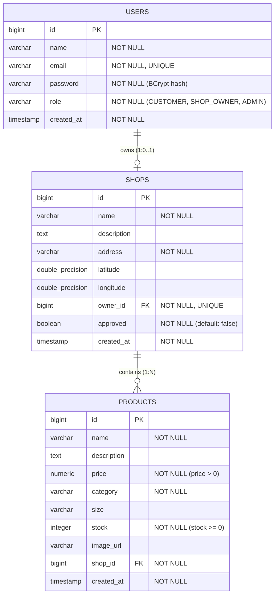
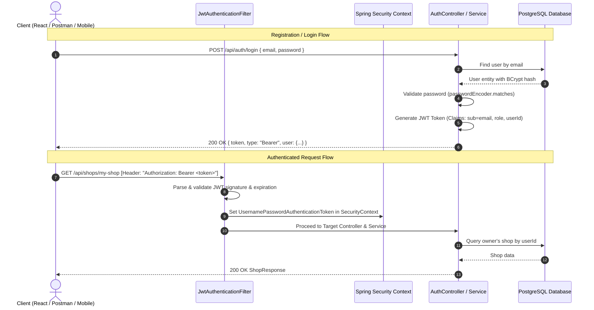

# Implementation Plan — Local Fashion Marketplace (Day 1 Backend)

Building a robust, production-oriented Spring Boot 3.x backend with PostgreSQL, Spring Security, JWT authentication, and clean layered architecture for the Local Fashion Marketplace.

## 1. Proposed Project Structure

A clean, modular monolith following layered architecture:

```
c:\My Projects\Website\
├── pom.xml
├── .gitignore
├── README.md
├── src
│   ├── main
│   │   ├── java
│   │   │   └── com
│   │   │       └── localmarket
│   │   │           ├── LocalMarketApplication.java
│   │   │           ├── config
│   │   │           │   ├── AppConfig.java
│   │   │           │   ├── OpenApiConfig.java (Swagger UI docs)
│   │   │           │   └── SecurityConfig.java
│   │   │           ├── controller
│   │   │           │   ├── AuthController.java
│   │   │           │   ├── ShopController.java
│   │   │           │   └── ProductController.java
│   │   │           ├── dto
│   │   │           │   ├── request
│   │   │           │   │   ├── RegisterRequest.java
│   │   │           │   │   ├── LoginRequest.java
│   │   │           │   │   ├── ShopCreateRequest.java
│   │   │           │   │   ├── ShopUpdateRequest.java
│   │   │           │   │   └── ProductRequest.java
│   │   │           │   └── response
│   │   │           │       ├── AuthResponse.java
│   │   │           │       ├── UserResponse.java
│   │   │           │       ├── ShopResponse.java
│   │   │           │       ├── ProductResponse.java
│   │   │           │       └── ErrorResponse.java
│   │   │           ├── entity
│   │   │           │   ├── Role.java (Enum: CUSTOMER, SHOP_OWNER, ADMIN)
│   │   │           │   ├── User.java
│   │   │           │   ├── Shop.java
│   │   │           │   └── Product.java
│   │   │           ├── exception
│   │   │           │   ├── ResourceNotFoundException.java
│   │   │           │   ├── DuplicateResourceException.java
│   │   │           │   ├── UnauthorizedException.java
│   │   │           │   ├── ForbiddenException.java
│   │   │           │   ├── BadRequestException.java
│   │   │           │   └── GlobalExceptionHandler.java
│   │   │           ├── repository
│   │   │           │   ├── UserRepository.java
│   │   │           │   ├── ShopRepository.java
│   │   │           │   └── ProductRepository.java
│   │   │           ├── security
│   │   │           │   ├── JwtTokenProvider.java
│   │   │           │   ├── JwtAuthenticationFilter.java
│   │   │           │   ├── CustomUserDetails.java
│   │   │           │   ├── CustomUserDetailsService.java
│   │   │           │   └── JwtAuthenticationEntryPoint.java
│   │   │           └── service
│   │   │               ├── AuthService.java
│   │   │               ├── ShopService.java
│   │   │               └── ProductService.java
│   │   └── resources
│   │       ├── application.properties
│   │       └── application-dev.properties
│   └── test
│       └── java
│           └── com
│               └── localmarket
│                   ├── LocalMarketApplicationTests.java
│                   ├── service
│                   │   ├── AuthServiceTest.java
│                   │   ├── ShopServiceTest.java
│                   │   └── ProductServiceTest.java
│                   └── controller
│                       ├── AuthControllerTest.java
│                       ├── ShopControllerTest.java
│                       └── ProductControllerTest.java
```

---

## 2. Database & Entity Relationship Design



### Key Relational Rules & Constraints
1. **User Table (`users`)**:
   - `email`: UNIQUE constraint + B-Tree index for quick login lookup.
   - `password`: Hashed using `BCryptPasswordEncoder` (cost factor 10+). Never exposed in DTO responses.
   - `role`: Stored as String (`CUSTOMER`, `SHOP_OWNER`, `ADMIN`).

2. **Shop Table (`shops`)**:
   - `owner_id`: Foreign key pointing to `users.id` with `UNIQUE` constraint (ensures 1 shop per shop owner).
   - `approved`: Boolean flag. Customers can only query approved shops (`approved = true`). Admins can approve/reject.

3. **Product Table (`products`)**:
   - `shop_id`: Foreign key pointing to `shops.id` (`ON DELETE CASCADE` via JPA orphanRemoval).
   - Ownership isolation: Updates and deletes strictly verify `product.shop.owner.id == authenticatedUser.id`.

---

## 3. Complete API Specification

### Authentication Module (`/api/auth`)
| Method | Endpoint | Access | Request Body | Response Body | Description |
| :--- | :--- | :--- | :--- | :--- | :--- |
| `POST` | `/api/auth/register` | Public | `RegisterRequest` | `AuthResponse` | Register user (`CUSTOMER`, `SHOP_OWNER`, `ADMIN`) & issue JWT |
| `POST` | `/api/auth/login` | Public | `LoginRequest` | `AuthResponse` | Authenticate user & issue JWT |
| `GET` | `/api/auth/me` | Authenticated | None | `UserResponse` | Get current logged-in user profile |

### Shop Module (`/api/shops`)
| Method | Endpoint | Access | Request Body | Response Body | Description |
| :--- | :--- | :--- | :--- | :--- | :--- |
| `POST` | `/api/shops` | `SHOP_OWNER` | `ShopCreateRequest` | `ShopResponse` | Create a shop for authenticated owner |
| `GET` | `/api/shops` | Public | None | `List<ShopResponse>` | List all approved shops |
| `GET` | `/api/shops/my-shop` | `SHOP_OWNER` | None | `ShopResponse` | Get authenticated owner's shop |
| `GET` | `/api/shops/{id}` | Public | None | `ShopResponse` | Get shop by ID |
| `PUT` | `/api/shops/{id}` | `SHOP_OWNER`, `ADMIN` | `ShopUpdateRequest` | `ShopResponse` | Update shop details (owner check enforced) |
| `PATCH` | `/api/shops/{id}/approve` | `ADMIN` | None (or status flag) | `ShopResponse` | Admin approves/rejects shop |
| `GET` | `/api/shops/all` | `ADMIN` | None | `List<ShopResponse>` | Admin gets all shops (approved & pending) |

### Product Module (`/api/products`)
| Method | Endpoint | Access | Request Body | Response Body | Description |
| :--- | :--- | :--- | :--- | :--- | :--- |
| `POST` | `/api/products` | `SHOP_OWNER` | `ProductRequest` | `ProductResponse` | Add product to authenticated owner's shop |
| `GET` | `/api/products` | Public | None (params: `shopId`, `category`, `search`) | `List<ProductResponse>` | Browse products with optional filters |
| `GET` | `/api/products/my-products` | `SHOP_OWNER` | None | `List<ProductResponse>` | Get all products belonging to owner's shop |
| `GET` | `/api/products/{id}` | Public | None | `ProductResponse` | Get product details by ID |
| `PUT` | `/api/products/{id}` | `SHOP_OWNER` | `ProductRequest` | `ProductResponse` | Update product (owner check enforced) |
| `DELETE` | `/api/products/{id}` | `SHOP_OWNER`, `ADMIN` | None | `Map<String, String>` | Delete product (owner check enforced) |

---

## 4. Authentication Flow



---

## 5. Dependencies (`pom.xml`)

| Dependency | Artifact ID | Purpose |
| :--- | :--- | :--- |
| Spring Boot Web | `spring-boot-starter-web` | REST API, Jackson JSON serialization, DispatcherServlet |
| Spring Data JPA | `spring-boot-starter-data-jpa` | ORM entities, repositories, transactions, Hibernate |
| Spring Security | `spring-boot-starter-security` | Authentication filter chain, password hashing, RBAC |
| Bean Validation | `spring-boot-starter-validation` | Request payload constraints (`@NotBlank`, `@Email`, `@Positive`, etc.) |
| PostgreSQL Driver | `org.postgresql:postgresql` | Production database connectivity |
| JJWT (JSON Web Token) | `io.jsonwebtoken:jjwt-api`, `jjwt-impl`, `jjwt-jackson` (0.12.6) | Modern, secure JWT token creation & parsing |
| SpringDoc OpenAPI | `springdoc-openapi-starter-webmvc-ui` (2.5.0) | Interactive Swagger UI API documentation at `/swagger-ui.html` |
| Spring Boot Test | `spring-boot-starter-test`, `spring-security-test` | Unit & MockMvc integration testing |
| H2 Database (test scope) | `com.h2database:h2` (`<scope>test</scope>`) | Fast in-memory database exclusively for automated unit/integration tests |

---

## 6. Incremental Implementation Plan

We will build the system step-by-step:

- **Module 1: Core Setup & Configuration**
  - Create `pom.xml`, Maven wrapper (`mvnw`), directory structure.
  - Create `application.properties` with PostgreSQL settings and customizable environment variables (`DB_URL`, `DB_USERNAME`, `DB_PASSWORD`, `JWT_SECRET`).
  - Create Global Exception handling (`GlobalExceptionHandler`, custom exceptions, `ErrorResponse`).
  - Create OpenAPI / Swagger configuration.

- **Module 2: Entities & Repositories**
  - Implement `Role` enum, `User`, `Shop`, `Product` entities with JPA annotations, auditing (`createdAt`), indexes, and relationships.
  - Implement `UserRepository`, `ShopRepository`, `ProductRepository` with custom query methods (e.g. `findByEmail`, `findByOwnerId`, `findByApprovedTrue`, `findByShopIdAndCategory`).

- **Module 3: Security & Authentication**
  - Implement `JwtTokenProvider` (generate, parse, validate tokens).
  - Implement `CustomUserDetails` and `CustomUserDetailsService`.
  - Implement `JwtAuthenticationFilter` and `JwtAuthenticationEntryPoint`.
  - Implement `SecurityConfig` (SecurityFilterChain, BCryptPasswordEncoder, CORS configuration, CSRF disabled, stateless session management).
  - Implement `AuthService` and `AuthController` with DTOs (`RegisterRequest`, `LoginRequest`, `AuthResponse`, `UserResponse`).

- **Module 4: Shop Management Module**
  - Implement DTOs (`ShopCreateRequest`, `ShopUpdateRequest`, `ShopResponse`).
  - Implement `ShopService` (create shop, get approved shops, get my shop, update shop, admin approve).
  - Implement `ShopController` with RBAC annotations (`@PreAuthorize("hasRole('SHOP_OWNER')")`, etc.).

- **Module 5: Product Management Module**
  - Implement DTOs (`ProductRequest`, `ProductResponse`).
  - Implement `ProductService` (create product, list with filters, update, delete with strict owner checks).
  - Implement `ProductController` with RBAC annotations and query parameter filtering.

- **Module 6: Automated Verification & Documentation**
  - Write comprehensive MockMvc & Service unit tests for Auth, Shop, and Product workflows.
  - Execute test suite and verify 100% passing status.
  - Provide interview explanation guide and API testing curl examples.

---

## Verification Plan

### Automated Tests
- Unit & Integration tests using `mvn test` (via Maven wrapper):
  - `AuthServiceTest` / `AuthControllerTest`: registration, login, bad credentials, duplicate email error.
  - `ShopServiceTest` / `ShopControllerTest`: shop creation, duplicate shop prevention, owner update validation, customer approved shop filter.
  - `ProductServiceTest` / `ProductControllerTest`: product CRUD, price/stock validation, cross-shop modification security protection.

### Manual Verification via REST API & Swagger UI
- Interactive testing using Swagger UI at `http://localhost:8080/swagger-ui.html` and curl scripts.
